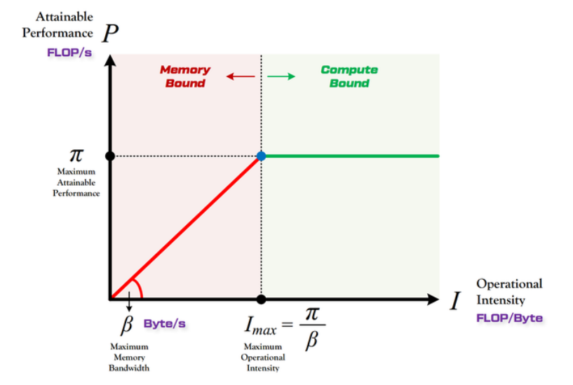
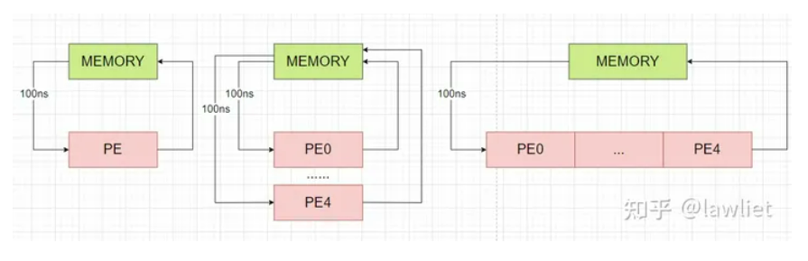
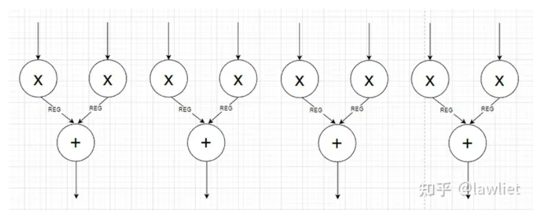
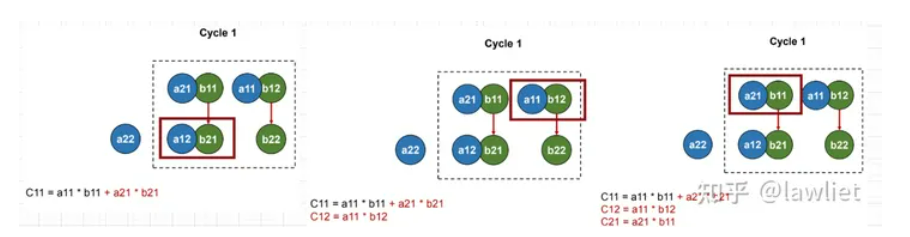

`Roofline Model`

!!! tip "在指定计算平台下，一个模型最大能达到的浮点计算速度的影响因素有哪些？"

    

    * 平台算力$\pi$(FLOP/s)
    * 平台带宽$\beta$(Byte/s)
    * 模型计算量C(FLOP/s)
    * 模型访存量M(Byte/s)

    

* 平台计算强度$I_{max}=\frac{\pi}{\beta}$(FLOP/Byte)
* 模型计算强度$I=\frac{C}{M}$(FLOP/Byte)
* 模型理论最大性能P(FLOP/s)  关注的指标

<figure markdown>
  { width="700" }
  <figcaption> Roofline model curve </figcaption>
</figure>

* Compute-Bound

模型的理论性能P受到计算平台算力$\pi$的限制,无法与计算强度I成正比,此时模型已经利用了计算平台的全部算力.

* Memory-Bound

模型理论性能P的大小完全由计算平台的带宽$\beta$以及模型自身的计算强度I所决定.

参考[`这篇博客`][1]

[1]: https://zhuanlan.zhihu.com/p/34204282

`Systolic array`

血液(data)通过心脏泵力作用流进血管(PE)，因此叫脉动整列.

<figure markdown>
  { width="500" }
  <figcaption> Three methods to perform operation </figcaption>
</figure>

* 方法一算力太低.
* 方法二算力提高，但以牺牲I/O带宽为代价.
* 方法三不牺牲I/O带宽，同时提高算力，因为利用中间数据在PE之间的流动，Systolic array利用该思想.

以二维矩阵乘法为例

 比较Adder Tree & Systolic array方案

=== "Adder Tree"

    <figure markdown>
      { width="700" }
      <figcaption> Adder Tree for matrix multiply operation </figcaption>
    </figure>

    !!! tip "乘法器应该有两个输入，图中画错了."

    - multiply和add各占一个周期，共需2T.
    - 第一个周期需要同时读取两个2×2矩阵的8个元素，I/O占用8Byte

=== "Systolic array"

    <figure markdown>
      { width="700" }
      <figcaption> Systolic array for matrix multiply operation </figcaption>
    </figure>

    - 安排外部数据读取和内部数据流动，共需4T.
    - 每个周期最多读入2个数据，I/O占用2Byte.

!!! tip "Systolic array 寻求算力和I/O带宽的trade-off"

参考[`这篇博客`][2]

[2]: https://zhuanlan.zhihu.com/p/650209037

