## [`SoC FPGA Acceleration for Semantic Segmentation of Clouds in Satellite Images`][1]

[1]: https://ieeexplore.ieee.org/document/9939585

### Summary

`卫星图像语义分割`

<div class="grid cards" markdown>

* __Network__: Lightweight Dilation U-Net
* __Dataset__: 95-Cloud Dataset
* __Device__: Xilinx MPSoC FPGA
* __Platform__: Vitis AI framework

</div>

`trade-off`

* accuracy
* execution time & hardware resources

`LD-UNet`
LD-UNet是UNet的简化版，减少computational cost和memory footprint，同时保持competitive performance.

  |                             |         LD-UNet         | UNet     |
  | :-------------------------: | :---------------------: | :------: |
  | downsampling and upsampling |            2            |    4     |
  |         convolution         | Dilation Residual Block | standard |

<figure markdown>
  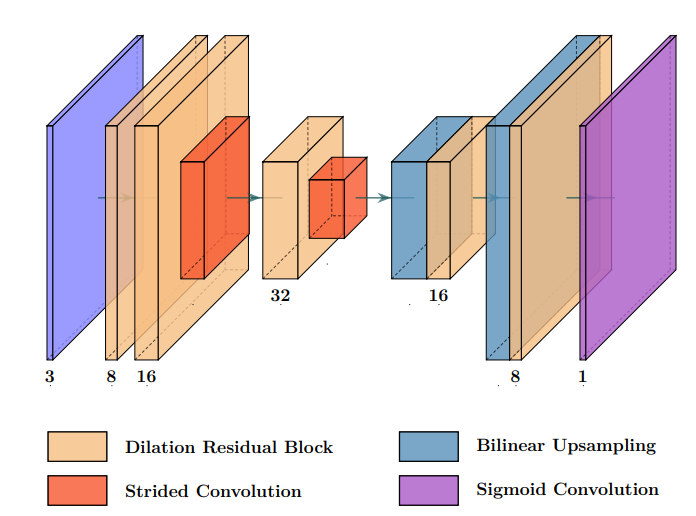{ width="500" }
  <figcaption> The LD-UNet CNN model </figcaption>
  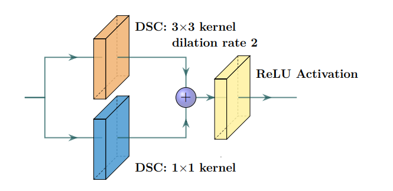{ width="500" }
  <figcaption> The custom Dilation Residual Block </figcaption>
</figure>

The first DSC involves a dilated depthwise convolution with a 3×3 kernel, dilation rate of 2 and stride 1 to __increase the receptive field__ of the convolution. The second DSC involves a depthwise convolution with a 1×1 kernel, acting as the identity __shortcut__ of the residual block.

Compare with other model -> best trade-off between param & accuracy

<figure markdown>
  { width="500" }
  <figcaption> Performance comparision </figcaption>
</figure>

`FPGA architecture`

ZYNQ分为两大部分——PS和PL：

- PS——post-processing
- PL——pre-processing(kernal) & inference(DPU)

<figure markdown>
  { width="500" }
  <figcaption> The FPGA processing architecture </figcaption>
</figure>

`result`

<figure markdown>
  { width="500" }
  <figcaption> Resources utilization </figcaption>
  { width="500" }
  <figcaption> Execution time </figcaption>
</figure>

## [`CloudSatNet-1: FPGA-Based Hardware-Accelerated Quantized CNN for Satellite On-Board Cloud Coverage Classification`][2]

[2]: https://www.semanticscholar.org/reader/5117475276af7c26e1f237241159d72ebda16f13

### Summary

`云层覆盖分类CNN的FPGA加速`

<div class="grid" markdown>

* __Network__: CloudSatNet-1
* __Dataset__: L8 biome Dataset
* __Device__: Xilinx Zynq-7020

</div>

!!! tip "Why cloud coverage classification?"

    satellite data :arrow_up: :point_right: downlink resourcecs tight :point_right: on-board classification

    通过分类丢弃被云覆盖的卫星图像，节省传输带宽

`method`

The current methods for cloud coverage estimation or classification are mainly categorized into __traditional__ and __machine-learning-based__ approaches


=== "Threshold-based (fixed or adaptive) method"

    Rely on a visible reflection and infrared temperature of the clouds :arrow_right: performance weakens on low-contrasted images

=== "Time differentiation"

    Do not consider changes in the top of atmosphere reflectance affected by floods.

=== "Statistical methods"

    Combine spectral and spatial features extracted from RSIs with classical machine learning algorithms (support vector machine, decision tree), but they lack to obtain the desired results

`neural network`

<figure markdown>
  { width="500" }
  <figcaption> CloudSatNet-1 architecture </figcaption>
</figure>

!!! tip "About quantization"

    * effect: param :arrow_down:  accuracy :arrow_up:  power consumption :arrow_up:  execution time :arrow_down:
    * weight & activations quantization对 __网络性能__ 影响不大，但可以减小 __memory footprint__ 方便在FPGA上的 __部署__ .

主要进行4-bit量化，头尾两层对量化更敏感，因此采用8-bit量化

`workflow`

<figure markdown>
  { width="500" }
  <figcaption>  Scheme of proposed workflow </figcaption>
</figure>

``` title="Quantization Step"

1. floating point model -> quantized onnx model   with QAT
2. quantized onnx model -> HLS code   with FINN framework
3. HLS code -> bit file    with Vivado
4. deploy on FPGA

```

`result`

=== "Metrics for different BW (including snow/ice)"

    <figure markdown>
      { width="500" }
      <figcaption> Results of cloud coverage classification for best-performed models </figcaption>
    </figure>

=== "Relationship between ACC and FPR"

    <figure markdown>
      { width="500" }
      <figcaption> Dependence of model ACC on inverse FPR value </figcaption>
    </figure>

=== "Metrics while deploying on FPGA"

    <figure markdown>
      { width="500" }
      <figcaption> Results of cloud coverage classification for best-performed quantized models on FPGA </figcaption>
    </figure>

=== "Resource utilization"

    <figure markdown>
      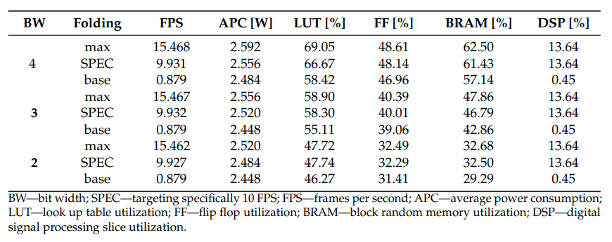{ width="500" }
      <figcaption> FPGA resource utilization and performance for different model bit widths and folding setup </figcaption>
    </figure>

!!! tip

    部署在FPGA上只有4/3/2 bit model，因为32 bit占用资源过多无法部署.

snow/ice类别与cloud coverage比较像，难以有效识别.

=== "Snow/Ice without cloud coverage"

    <figure markdown>
      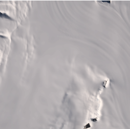{ width="500" }
      <figcaption> Snow/Ice </figcaption>
    </figure>

=== "Water with cloud coverage"

    <figure markdown>
      { width="500" }
      <figcaption> Water </figcaption>
    </figure>

=== "Metrics for different biomes"

    <figure markdown>
      { width="500" }
      <figcaption> Results of cloud coverage classification for best-performed 4-bit width models per biome </figcaption>
    </figure>

!!! tip "Try to exclude snow/ice"

    将snow/ice类别排除进行测试，识别新能显著提升.

`flaw`

- High value of FPR on cloud-like feature (e.g. snow/ice).    :tools: multi-spectral bands
- Original L8 biome dataset were merged to form a binary problem.
- Did not cover the effects of the radiation on the cloud detection system.

### Question

!!! example "宁愿多处理负样本也不愿意丢弃正样本，不是应该使FNR(False Negative Rate)更低吗?"

    However, rather than the highest overall accuracy, this study emphasizes on the low FPR (it is more convenient to process a redundant image than to discard the relevant one).

!!! example "没有具体说怎么控制network throughput. "

    Based on the estimated number of cycles per layer reported in Table 3, it is visible that a bottle-neck in the first layer limited the optimal throughput, and it would require a change in the network architecture to allow a higher throughput target. It was demonstrated that the network throughput can be controlled to target a specific FPS desired by the needs of the mission.

## [`FPGA-Based Implementation of Ship Detection for Satellite On-Board Processing`][3]

[3]: https://ieeexplore.ieee.org/stamp/stamp.jsp?tp=&arnumber=9933643

### Summary

`卫星在轨船只检测任务`

<div class="grid cards" markdown>

* __Ship Detection Algorithm__
* __Optimized Method__
* __FPGA Architecture__
* __Device__: Xilinx XQR5VFX130

</div>

=== "Hardware-oriented Clustering"

    Each processing engine can implement a sort of image operation functions, which has a similar regularity of operation and accessing.

=== "Data-buffer Cycle"

    The DBC provides a method to analyze the memory occupancy period. The memory reuse rules for intermediate are designed according to DBC.

<figure markdown>
  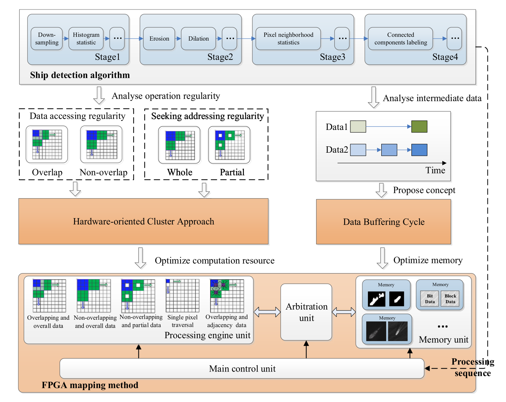{ width="700" }
  <figcaption> Workflow of the proposed optimization mapping method </figcaption>
</figure>

`Hardware-oriented Clustering`

regularity of data reading and writing -> clustering processing engine 

According to Overlap/Non-overlap & Whole/Partial Pixals.

<figure markdown>
  { width="500" }
  <figcaption> Data accessing and seeking addressing regularity </figcaption>
</figure>

!!! tip 

    覆盖的数据可以保留使用，避免重复读取；并不是所有操作都需要窗口中的所有像素值.

5 categories:

* overlaping and whole data
* non-overlaping and whole data
* non-overlaping and partial data
* overlaping and adjacency(partial) data
* single pixel traversal

<figure markdown>
  { width="700" }
  <figcaption> Example for 5 categories </figcaption>
</figure>

Compare clustering method with traditional method.

=== "7 processing modules"

    <figure markdown>
      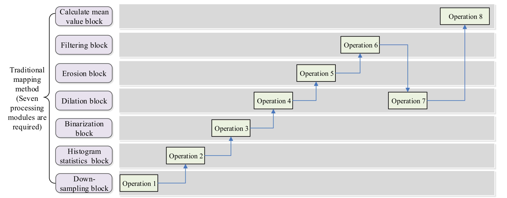{ width="500" }
      <figcaption> Traditional method </figcaption>
    </figure>

=== "3 processing modules"

    <figure markdown>
      { width="500" }
      <figcaption> Clustering method </figcaption>
    </figure>

!!! tip

    该方法不改变流程，只起到复用模块，节省计算资源的用处.

`Data-buffer Cycle`

We assume that the intermediate data are generated in the Nth processing step and used by the Mth processing step. Then, the DBC is defined as M-N. The length of the DBC is equivalent to the total time that the data takes up in memory.

3 categories:

* DBC = 1 -> short
* DBC > 60% of all steps -> long
* remain -> median

!!! example "DBC(D1) = 4  generated in step1, used in step 5"

    <figure markdown>
      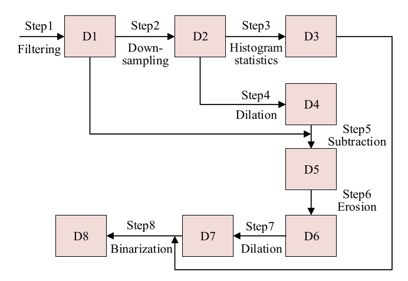{ width="500" }
      <figcaption> Example of processing algorithm </figcaption>
    </figure>

`implementation`

<figure markdown>
  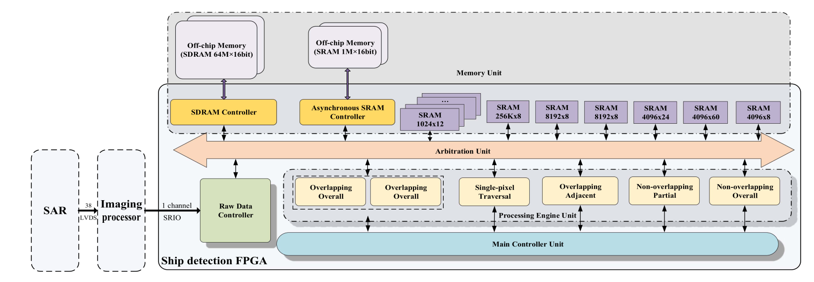{ width="700" }
  <figcaption> Architecture overview </figcaption>
</figure>

每个PEU(Processing Engine Unit)由相同的几部分构成:

* __operation module__: 执行计算操作(clutering后的操作)
* __schedule module__: 根据timing判断该进行什么操作，下发给operation module
* __resister control module__: 变更参数，read enable等信号
* __monitor module__: 用于调试观察

=== "overlaping and whole"

    <figure markdown>
      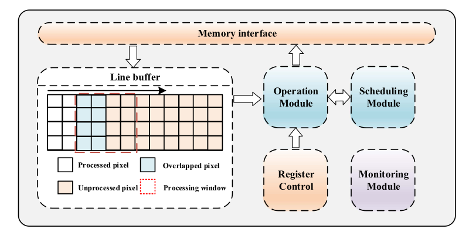{ width="500" }
      <figcaption> Overlapping and overall data engine </figcaption>
    </figure>

=== "non-overlaping and whole"

    <figure markdown>
      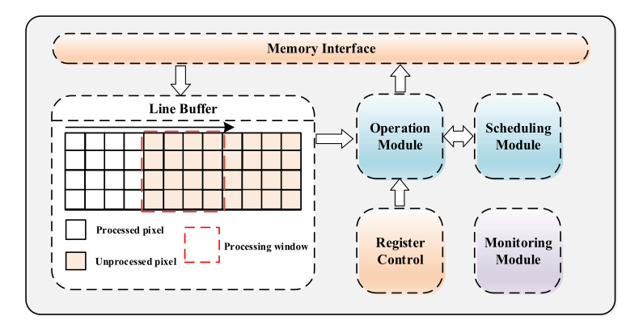{ width="500" }
      <figcaption> Nonoverlapping and overall data engine </figcaption>
    </figure>

=== "non-overlaping and partial"

    <figure markdown>
      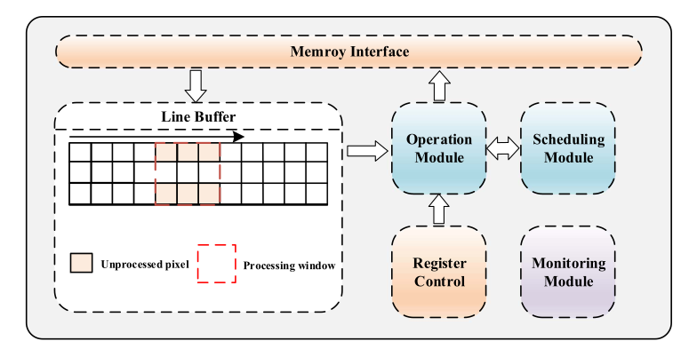{ width="500" }
      <figcaption> Nonoverlapping and partial data engine </figcaption>
    </figure>

=== "overlaping and adjacency(partial)"

    <figure markdown>
      { width="500" }
      <figcaption> Overlapping and adjacency data engine </figcaption>
    </figure>

=== "single pixel traversal"

    <figure markdown>
      { width="500" }
      <figcaption> Single pixel traversal engine </figcaption>
    </figure>

MU(Memory Unit) is divided into 2 part: On-chip & Off-chip

<figure markdown>
  { width="500" }
  <figcaption> MU Statistics </figcaption>
</figure>

`result`

<figure markdown>
  { width="500" }
  <figcaption> Detection example </figcaption>
</figure>

Compare with other devices using the same algorithm. Using __OPENCV__ to add some image-processing function.

|                  CPU                   | DSP                | FPGA     | FPGA | FPGA            |
| :------------------------------------: | ------------------ | -------- | ---- | --------------- |
| DELL workstation<br/>(E5-2650, 8G RAM) | TS201<br/>(800MHz) | pipeline | HLS  | proposed method |

<figure markdown>
  { width="500" }
  <figcaption> Resource consumption results of different devices </figcaption>
</figure>

`real-time performance`

<figure markdown>
  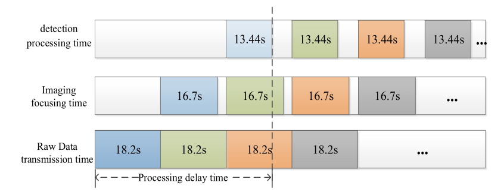{ width="500" }
  <figcaption> Resource consumption results of different devices </figcaption>
</figure>

当$\tau = \frac{T_{Tr}}{Max(T_{Im},T_{Dp})} > 1$时，可实现real-time performance[^1].

- $T_{Tr}$:原始数据获取时间

- $T_{Im}$:image focusing时间

- $T_{Dp}$:image detection时间

[^1]: System can guarantee the outputs continuously in case of continuous inputs.

### Question

!!! example "这几句话没说清楚，short 和 long 都是用一样的存储单元?"

    The short DBC data are arranged to use the same storage. The medium DBC data can reuse memory in the case that the algorithm processing flows arenot affected. The standalone storage is reserved for the long DBC data.

!!! example "What is FPGA with pipeline and HLS?"

## [`An FPGA-Based Hybrid Neural Network Accelerator for Embedded Satellite Image Classification`][4]

[4]: https://ieeexplore.ieee.org/document/9180625

### Summary

`混合FPGA网络模型加速器架构`

<div class="grid cards" markdown>

* __Application__: Cloud coverage classification
* __Formal Neural Network__: Feature extraction
* __Spiking Neural Network__: Classification (Fully connect)
* __Device__: Xilinx Cyclone V FPGA

</div>

<figure markdown>
  { width="700" }
  <figcaption> Topology of hybrid network </figcaption>
</figure>

`formal domain`

具有高度并行性

=== "Convolution layer"

    !!! example "About filter-wise adder"

        filter-wise filter可以同时对不同channel的feature map进行计算，需要同时存储$C_{in} \times C_{out}$个conv kernal.

    <figure markdown>
      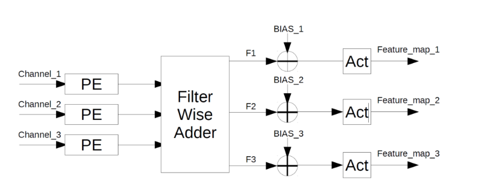{ width="500" }
      <figcaption> Schematic representation of the convolution layer architecture </figcaption>
    </figure>

=== "Maxpoolong layer"

    Maxpooling consists in dividing the 2D input in patches, extracting the maximum value of each patch, and building a sub-sampled version of the input with only those maximum values.

`interface between formal and spiking domain`

- Data flow: Flattening Module -> Spiking Generation Cell

- Spikes are represented by 2 co-occurrent signal: o_spike & o_addr.

`spiking domain`

__Integrating__ weighted input events, __triggering__ an output event when the accumulator overpasses a __threshold__, and __resetting the accumulator__ when emitting an output event.

<figure markdown>
  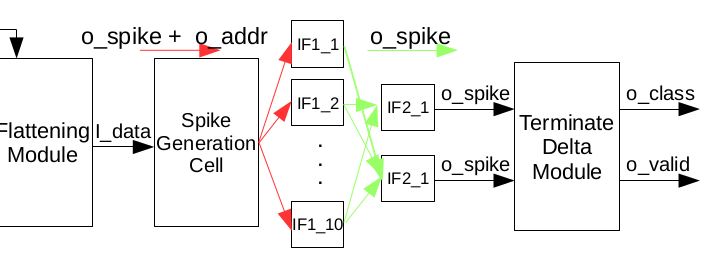{ width="700" }
  <figcaption> Schematic representation of classification modules </figcaption>
</figure>

10 * IF_1 & 2 * IF_2 & Terminate Delta Module -> count spikes and enact classification outcome.

!!! tip

    只有spike generation module后的spike需要o_addr，其他直接通过neuron间的连接传递信息.

`architecture`

<figure markdown>
  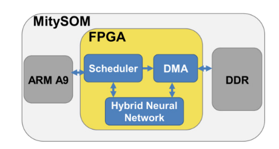{ width="500" }
  <figcaption> Schematic representation of the full system architecture </figcaption>
</figure>

1. ARM A9读取图片并分割，储存在DDR中.
2. scheduler根据image pitch地址设置DMA，并触发CNN accelerator.
3. scheduler将结果存回DDR中.

`result`

<figure markdown>
  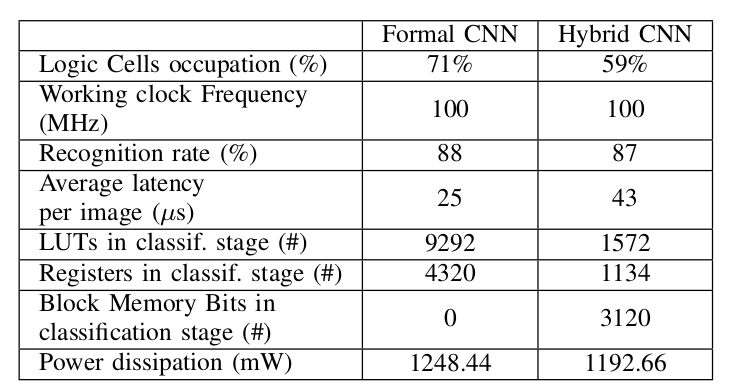{ width="500" }
  <figcaption> Results of our Hybrid Architecture and its formal counterpart </figcaption>
</figure>

### Question

!!! example "为什么有/255?period范围不是$[\frac{1}{MaxFreq},\frac{1}{MinFreq}]$."

    <figure markdown>
      { width="500" }
      <figcaption> Calculate the period for SNN </figcaption>
    </figure>


## [`FPGA-based Satellite Image Classification for Water Bodies Detection`][5]

[5]: https://ieeexplore.ieee.org/document/9171811

### Summary

`为火情处理提供服务的水体探测分类加速`

<div class="grid cards" markdown>

* __Application__: Water body classification
* __Algorithm__: Decision tree and Minimun distance
* __Device__: Zynq UltraScale+ FPGA

</div>

=== "Origin"

    <figure markdown>
      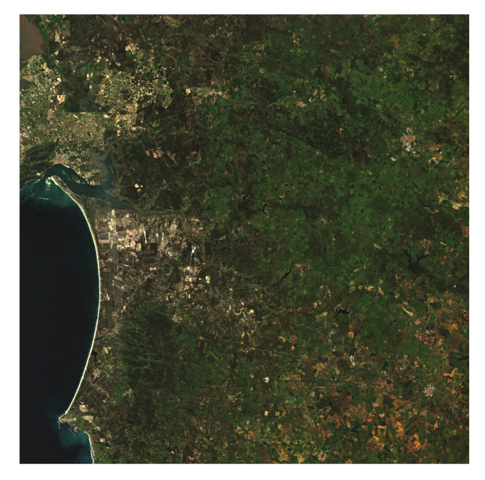{ width="300" }
      <figcaption> Original RGB Image </figcaption>
    </figure>

=== "Result"

    <figure markdown>
      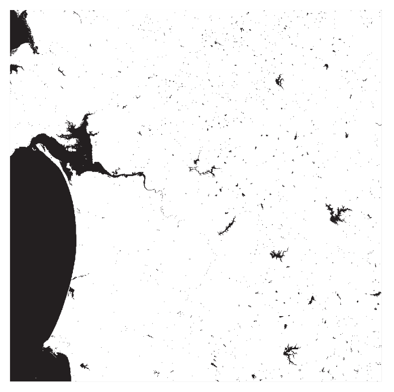{ width="300" }
      <figcaption> Output of Decision Tree Classifier </figcaption>
    </figure>

If the project to be implemented requires __lot of calculations__ and they have the possibility to fully be __parallelized__, __FPGA__ benefits of its high number of Digital Signal Processors to accelerate these calculations. If a more __sequential approach__ is taken, __CPU__ will perform the same result faster.

!!! example "decision tree时CPU比FPGA快400倍，minimun distance时FPGA比CPU快4.5倍."

## [`FPGA Implementation of a Hardware Optimized Automatic Target Detection and Classification Algorithm for Hyperspectral Image Analysis`][6]

[6]: https://ieeexplore.ieee.org/stamp/stamp.jsp?tp=&arnumber=9817130

### Summary

`FPGA实现超光谱图像自动识别与分类`

<div class="grid cards" markdown>

* __Application__: ATDCA on HSI (Hyper Spectral Image)
* __GS orthogonalization__
* __Device__: Zynq Ultrascale + ZCU106 System
* __Advantage__: Execution time and power consumption

</div>


## [`An FPGA-Based Hardware Accelerator for CNNs Inference on Board Satellites: Benchmarking with Myriad 2-Based Solution for the CloudScout Case Study`][7]

[7]: https://www.semanticscholar.org/reader/b3e29278e89c995a9fabf856d4aed21fe0c93d08

### Summary

`基于CloudScout的CNN加速器`

<div class="grid cards" markdown>

* __Application__: Cloud detection on hyperspectral images
* __Study Case__: CloudScout
* __Device__: Zynq Ultrascale+ ZCU106
* __Counterpart__: Intel Mariad 2 VPU

</div>

!!! example "Why not Myriad 2?"

    * :smiley: Achieve good timing performance and reduced power consumption.
    * :smiling_face_with_tear: Not designed for space environment (lacking in radiation-tolerant).
    * :smiling_face_with_tear: Not customizable. (space-oriented communication protocol, operative system, redundancy structures ...).
    <br/><br/> :point_right: brief LEO mission only

`accelerator categories`

This framework uses single PU architecture.

=== "__Single Processing Unit architecture__"

    * Compute operations of all the layers.
    * :smiley: Reduce resource exploitation.
    * :smiling_face_with_tear: Increased latency and power consumption. (Data access)
    * Tiling or the use of additional caches are some of the techniques to reduce the amount of data to store.

=== "Streamline architecture"

    * Consists of a cascade of several blocks, one per layer of the network.
    * :smiley: Reducing latency and power consumption. (only the input image shall be read)
    * :smiley: Exploiting pipeline.
    * :smiley: Allows optimizing the architecture of specific layers at the price of an increased latency.
    * :smiling_face_with_tear: Overhead in terms of hardware resources.

=== "Multiple Shared Processing Units architecture"

    * Exploiting several PUs shared by layers with similar computation requirements.
    * :smiley: Better utilization of hardware and an increment of throughput compared to the solution using a single PU.
    * :smiling_face_with_tear: Reduced portability. (association of PUs)

`model quantization`

Network architecture as following.

<figure markdown>
  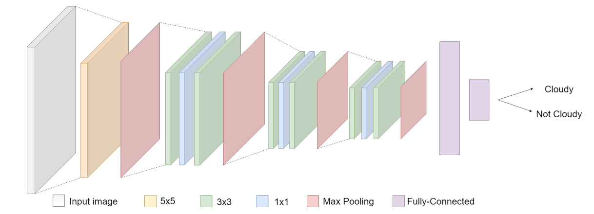{ width="500" }
  <figcaption> CloudScout Model Architecture </figcaption>
</figure>

参考文献做法，各层量化位数由下式给出

$$b_{in}|_{layer=q+1} = (b_{out}-b_{tr}-b_{sat})|_{layer=q}$$

`accelerator architecture`

<figure markdown>
  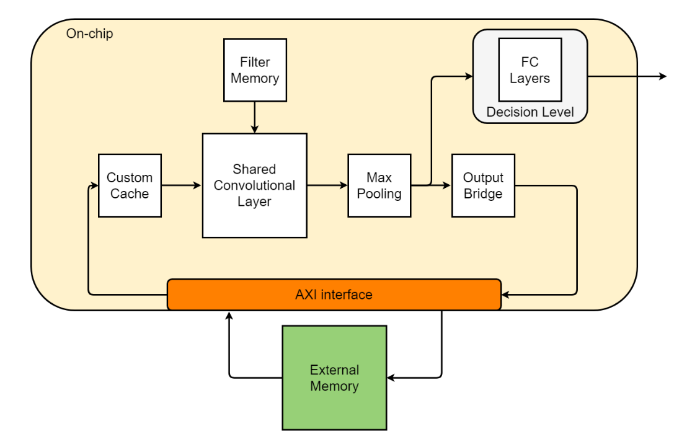{ width="500" }
  <figcaption> CloudScout Hardware Accelerator architecture </figcaption>
</figure>

=== "Custom Cache"

    * Storing tiles of the feature maps.
    * The cache can be filled while the accelerator is performing computations.
    * Parameter: $C_{width}$, $C_{depth}$ and N_{co}.
    * Memory footprint: $M_{fp} = C_{width} \times C_{depth} \times N_{co}$

    <figure markdown>
      { width="500" }
      <figcaption> Custom cache scheduling example </figcaption>
    </figure>

    !!! tip "About selecting parameters"

        $C_{depth}$ is given by evaluating the minimum storage resources needed by each layer to start computing. $M_{fp}$ should not to exceed the available FPGA on-chip memory resources.

=== "Shared Convolutional Layer"


=== "Filter Memory"


=== "Max Pooling"


`result`

Deploy on Zynq Ultrascale+ ZCU106 Development Board and __rad-hard__ Xilinx Kintex Ultrascale XQRKU060

<br/> Output as following.

<figure markdown>
  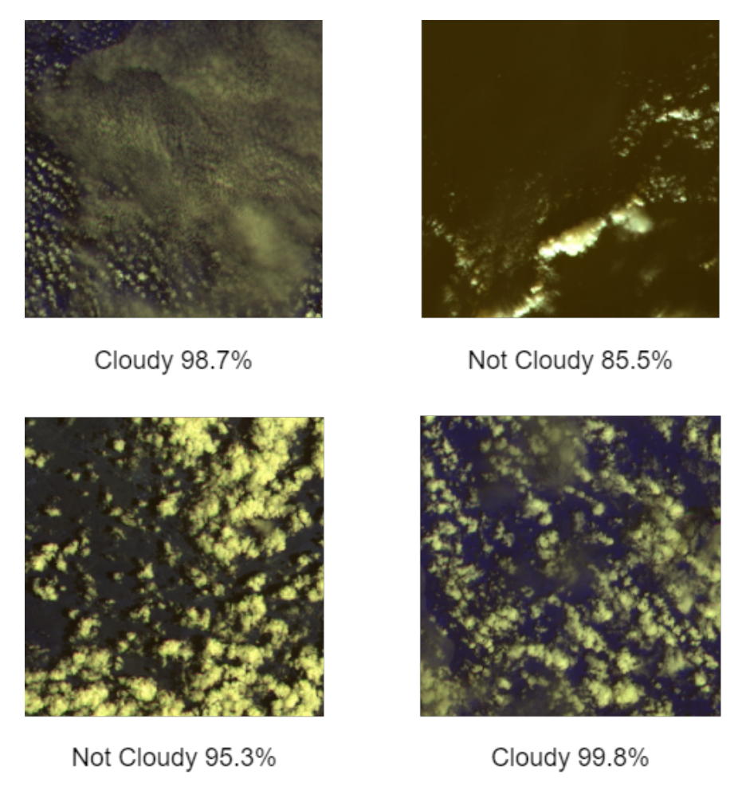{ width="500" }
  <figcaption> Examples of accelerator outputs </figcaption>
</figure>

=== "Zynq Ultrascale+ ZCU106"

    <figure markdown>
      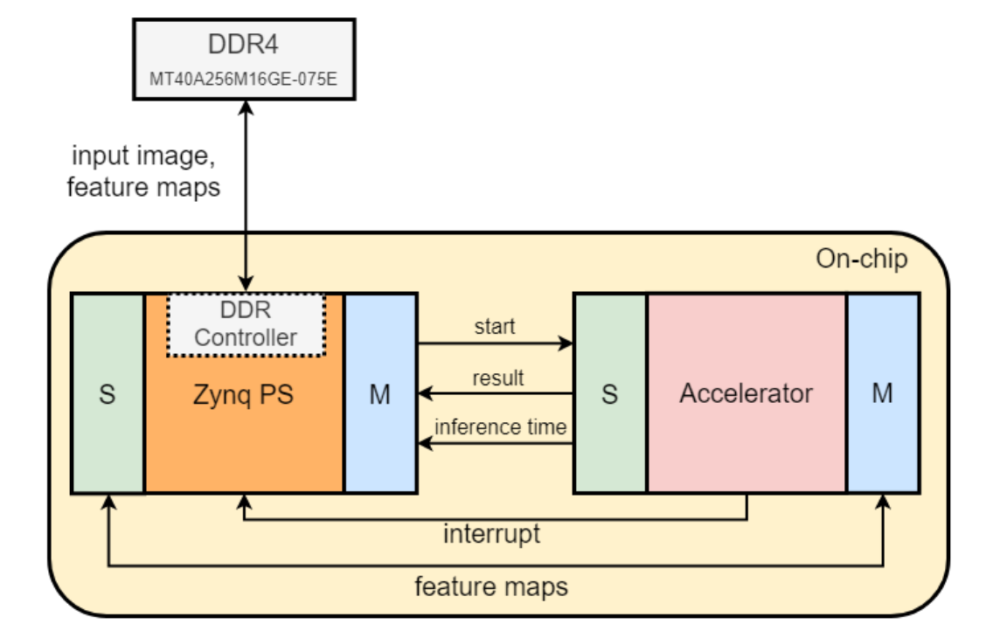{ width="500" }
      <figcaption> CloudScout characterization system </figcaption>
    </figure>

    * PS-Master-Accelerator-Slave interface负责读写加速器状态.
    ​* Accelerator-Master-PS-Slave interface负责数据传送.

    !!! tip

        Accelerator AXI Master使用asynchronous FIFO, 使数据读取时钟频率独立于加速器频率, 减少transfer overhead times.
    
    <figure markdown>
      { width="500" }
      <figcaption> Measured results summary </figcaption>
      { width="500" }
      <figcaption> Resource occupation for the entire system </figcaption>
    </figure>

    * UltraRAM -> Custom Cache
    * BlockRAM -> Filters and AXI FIFOs
    * DSP -> MAC modules in the SCL and in the Fully-Connected layers

=== "Kintex Ultrascale XQRKU060"

    <figure markdown>
      { width="500" }
      <figcaption> Measured results summary </figcaption>
      { width="500" }
      <figcaption> Resource occupation for the entire system </figcaption>
    </figure>

    !!! tip

        The XQRKU060 has worse timing performance with respect to the design implemented on the ZCU106 board because it belongs to an older FPGA family (Ultrascale vs. UltraScale+).

`benchmark`

- technology


- inference time


- power consumption


### Question

!!! example "Custom Cache的$C_{width}$是一个AXI packet的长度，还是一个data的字长?"


## [`H-BNN: FPGA-based binarized convolutional neural network for cloud detection on satellite payload`][8]

[8]: https://ieeexplore.ieee.org/document/10227207


## (Literature Review)[`A Survey of FPGA-based Accelerators for Convolutional Neural Networks`][9]

[9]: https://embdev.net/attachment/378695/2018_NCAA_Mittal_FPGA_Accelerator_CNN.pdf

## [`Tile-Grained Pipeline Architecture for Low Latency CNN Inference`][10]

[10]: https://vast.cs.ucla.edu/sites/default/files/publications/PID5488167.pdf

## [`A High Performance FPGA-based Accelerator for  Large-Scale Convolutional Neural Networks`][11]

[11]: https://ieeexplore.ieee.org/document/7577308

## [`MEM-OPT: A Scheduling and Data Re-Use System to Optimize On-Chip Memory Usage for CNNs On-Board FPGAs`][12]

[12]: https://ieeexplore.ieee.org/document/9163269

## [`A Complete Design Flow for Mapping CNN Onto Embedded FPGA`][13]

[13]: https://ieeexplore.ieee.org/document/7930521

## (Literature Review)[`Deep Learning on FPGAs Past, Present, and Future`][14]

[14]: https://www.semanticscholar.org/reader/ee8c33a09b94377741c8c4e12cfc9174b9bcc7a1
